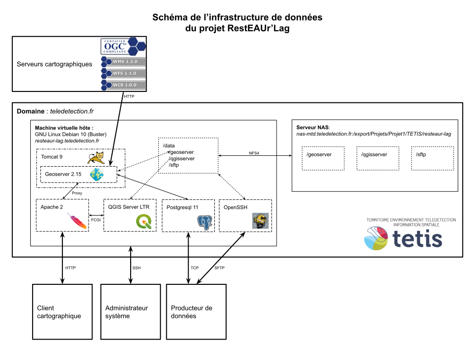

L'infrastructure de données est hébergée par TETIS sur le domaine
teledetection.fr ; elle est composée en deux blocs : une machine
virtuelle Linux (resteaur-lag.teledetection.fr) associée à une partition
sur un serveur de données NAS (nas-mtd.teledetection.fr), qui est
accessible dans la machine virtuelle sous le chemin « /data » .

La machine virtuelle étant limitée à 80 Go, c'est sur le serveur NAS
qu'il faut stocker les données volumineuses (1 To disponible). En
revanche, la base de données
[Postgres](https://www.postgresql.org/docs/11/index.html) est stockée
dans le disque de la machine virtuelle pour un meilleur temps de réponse
aux requêtes. Il est possible d'accéder directement à la base Postgres
depuis une autre machine équipée du client PGSQL.

Afin de faciliter le déploiement et la mise à jour de
[GeoServer](https://docs.geoserver.org/maintain/en/user/#), celui-ci est
exécutée par un conteneur d'application dénommé
[Tomcat](https://tomcat.apache.org/tomcat-9.0-doc/index.html). Cela
permet notamment d'isoler l'application du reste du système ce qui
ajoute un couche de sécurité supplémentaire. L'ensemble des données et
paramètres de GeoServer sont isolées du reste de l'application et
stockées sur le NAS. GeoServer permet également de rediriger d'autres
serveurs cartographiques externes et d'en lister les capacités (couches
disponibles).

Toutes les requêtes HTTP reçues par le serveur sont traitées par [Apache
2](http://httpd.apache.org/docs/2.4/) qui est chargé de rediriger
celles-ci vers GeoServer (via un proxy) ou
[QgisServer](https://docs.qgis.org/3.4/fr/docs/user_manual/working_with_ogc/server/index.html)
(via le protocole FCGI). De plus, Apache permet de mettre en ligne une
page web, HTML/CSS.

Le protocole SSH (Secure Shell) permet d'accéder à la machine virtuelle
en lignes de commandes ou via une interface graphique grâce aux
programmes [OpenSSH](https://www.openssh.com/manual.html) et
[X2Go](https://wiki.x2go.org/doku.php/doc:start). Cela permet,
entre-autres, d'exécuter des programmes comme
[QGIS](https://docs.qgis.org/3.4/fr/docs/), ou simplement un
gestionnaire de fichier (pour ne pas avoir à organiser ses données en
utilisant des lignes de commande). OpenSSH permet également de réaliser
des échanges de fichiers sécurisés via le protocole SFTP (Secure File
Transfer Protocol), il est donc possible de verser des données sur le
serveur grâce à des outils type
[FileZillia](https://wiki.filezilla-project.org/Documentation).

Toutes les données accessibles en SFTP sont stockées sur le NAS, et sont
disponibles dans le système sous le chemin ( /data/sftp ). Les
connexions SFTP sont possibles seulement avec un utilisateur dédié
(sftpuser) qui aura accès uniquement aux sous-répertoires de cette
arborescence (/data/sftp/ ). Cette couche de sécurité nommée « chroot
jail » évite qu'une personne connectée en SFTP puisse accéder au système
hôte.

En revanche les dossiers de données GeoServer et QGIS Server
(/data/geoserver/data - /data/qgisserver ) sont rendus disponibles dans
le dossier SFTP (/data/sftp/geoserver\_data - /data/sftp/qgis\_projects
) via une commande « mount \--bind ». Cela permet à tout le monde
d'alimenter les données du serveur cartographique sans avoir à utiliser
des lignes de commandes ; il suffit ensuite de renseigner les données
téléchargées dans l'interface graphique de GeoServer.